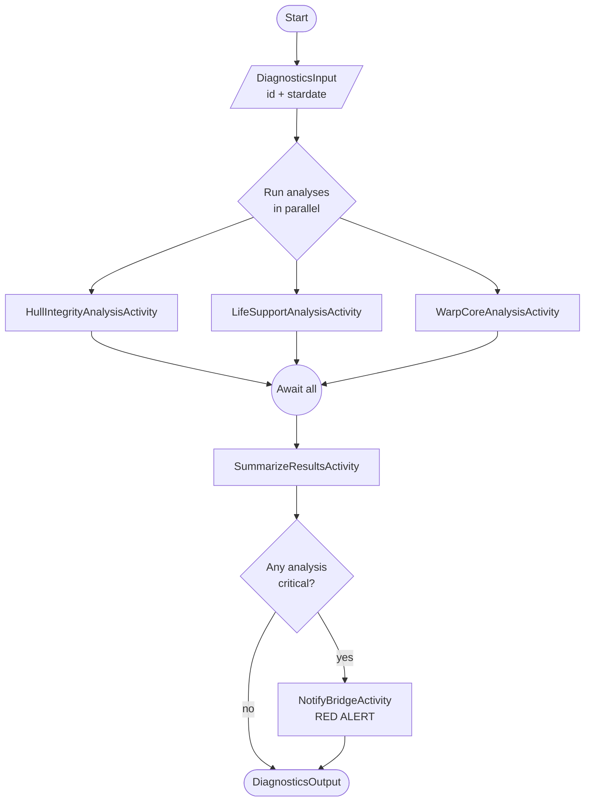

# EnterpriseDiagnostics

A Dapr Workflow application that runs a full diagnostic sweep on the U.S.S. Enterprise. The workflow performs three independent analyses in parallel — hull integrity, life support, and warp core — summarizes the results, and notifies the bridge if any analysis is marked as critical.

## Contents

- `EnterpriseDiagnostics.AppHost` — Aspire AppHost that orchestrates the Valkey state store, the Dapr sidecar, the ApiService, and the Diagrid Dev Dashboard.
- `EnterpriseDiagnostics.ApiService` — ASP.NET Core service that hosts the Dapr workflow, activities, and the HTTP endpoints used to manage workflow instances.
- `EnterpriseDiagnostics.ServiceDefaults` — Aspire shared project providing OpenTelemetry, health checks, service discovery, and resilience defaults.

## Architecture

The solution is built on:

- **.NET 10 / ASP.NET Core** — host for the workflow service.
- **.NET Aspire** — orchestrates the local development topology (AppHost + ServiceDefaults).
- **Dapr Workflow** (`Dapr.Workflow`, `Dapr.Workflow.Versioning`) — durable, replay-safe orchestration on top of the Dapr sidecar.
- **Valkey** — a Redis-compatible state store, started as a container resource by Aspire on port `16379`. Used by the Dapr actor framework for workflow state persistence.
- **Diagrid Dev Dashboard** — a container resource that visualizes workflow instances and their execution history.

### Prerequisites

To run the application locally you need:

- [.NET 10 SDK](https://dotnet.microsoft.com/en-us/download)
- [Aspire CLI](https://aspire.dev/get-started/install-cli/)
- [Docker](https://www.docker.com/products/docker-desktop/) or [Podman](https://podman.io/docs/installation)
- [Dapr CLI](https://docs.dapr.io/getting-started/install-dapr-cli/) (1.17+)

You do **not** need to start Redis or Valkey separately — Aspire manages the Valkey container for you.

## Workflow



## Run the application

From the solution root:

```shell
aspire run
```

This launches the Aspire AppHost which orchestrates:

- The **Valkey** state store container on port `16379`.
- The **ApiService** with an attached **Dapr sidecar** that loads `Resources/statestore.yaml`.
- The **Diagrid Dev Dashboard** container that loads `Resources/statestore-dashboard.yaml`.

The Aspire dashboard opens automatically in your browser and lists all resource endpoints (ApiService, Dapr sidecar, Diagrid Dashboard) with live logs and traces.

## Endpoints

The ApiService exposes these endpoints (see `EnterpriseDiagnostics.ApiService/Program.cs`):

| Method | Path                       | Purpose                                  |
|--------|----------------------------|------------------------------------------|
| POST   | `/start`                   | Schedule a new diagnostics workflow      |
| GET    | `/status/{instanceId}`     | Read the current state and output        |
| POST   | `/pause/{instanceId}`      | Suspend a running workflow               |
| POST   | `/resume/{instanceId}`     | Resume a suspended workflow              |
| POST   | `/terminate/{instanceId}`  | Terminate a workflow instance            |

Replace `5407` with the actual ApiService port shown in the Aspire dashboard.

### Start a diagnostics workflow

```shell
curl -X POST http://localhost:5407/start \
  -H "Content-Type: application/json" \
  -d '{"id":"diag-001","stardate":"47988.1"}'
```

### Get the workflow status

```shell
curl http://localhost:5407/status/diag-001
```

### Pause / resume / terminate

```shell
curl -X POST http://localhost:5407/pause/diag-001
curl -X POST http://localhost:5407/resume/diag-001
curl -X POST http://localhost:5407/terminate/diag-001
```

You can also drive these requests from [`EnterpriseDiagnostics.ApiService/EnterpriseDiagnostics.ApiService.http`](EnterpriseDiagnostics.ApiService/EnterpriseDiagnostics.ApiService.http) using the VS Code REST Client or JetBrains HTTP Client.

## Inspecting workflow execution

The **Diagrid Dev Dashboard** container is started by Aspire and connects to the same Valkey state store as the ApiService Dapr sidecar (via `host.docker.internal:16379`).

To inspect workflow instances:

1. Open the Aspire dashboard (it launches automatically on `aspire run`).
2. Find the `diagrid-dashboard` resource in the resource list.
3. Click the HTTP endpoint link to open the dashboard in your browser.
4. Use the dashboard to browse workflow instances, view the orchestration history, inspect activity inputs/outputs, and watch state transitions in real time.
