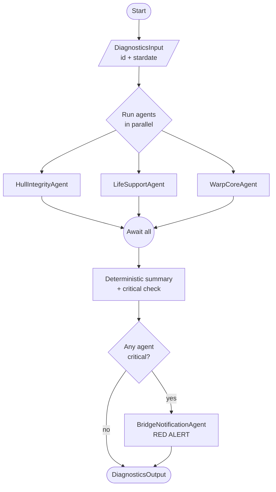

# EnterpriseDiagnostics

This repo contains an agentic application that runs a full diagnostic sweep on the U.S.S. Enterprise. The application runs three independent LLM-driven analyses in parallel — hull integrity, life support, and warp core — composes a deterministic summary, and (when any analysis is critical) calls a bridge-notification agent to acknowledge the alert.

## Contents

- `EnterpriseDiagnostics.AppHost` — Aspire AppHost that provisions a Diagrid Catalyst project with a managed workflow state store, wires the ApiService to it, and forwards `OPENAI_API_KEY` to the service.
- `EnterpriseDiagnostics.ApiService` — ASP.NET Core service that hosts the diagnostics workflow, the four agents, and the HTTP endpoints used to start and observe runs.
- `EnterpriseDiagnostics.ServiceDefaults` — Aspire shared project providing OpenTelemetry, health checks, service discovery, and resilience defaults.

## Architecture

The solution is built on:

- **.NET 10 / ASP.NET Core** — host for the workflow service.
- **.NET Aspire** — orchestrates the local development topology (AppHost + ServiceDefaults).
- **Diagrid Catalyst** — managed workflow runtime based on Dapr, provisioned by the Aspire AppHost via `AddCatalystProject(...)` with `EnableManagedWorkflow = true`.
- **Microsoft Agent Framework** (`Microsoft.Agents.AI`) — the `ChatClientAgent` abstraction used for each diagnostic role.
- **Diagrid.AI.Microsoft.AgentFramework** — Diagrid integration that runs each agent invocation as a Dapr Workflow activity, so agent calls are checkpointed and replay-safe.
- **OpenAI** (`gpt-4o-mini`) — chat backend for the agents, accessed via `Microsoft.Extensions.AI.OpenAI`.

### Prerequisites

To run the application locally you need:

- [.NET 10 SDK](https://dotnet.microsoft.com/en-us/download)
- [Aspire CLI](https://aspire.dev/get-started/install-cli/)
- [Docker](https://www.docker.com/products/docker-desktop/) or [Podman](https://podman.io/docs/installation)
- [Diagrid CLI](https://docs.diagrid.io/catalyst/references/cli-reference/install-diagrid-cli)
- A [Diagrid Catalyst](https://www.diagrid.io/catalyst) account, signed in via `diagrid login`
- An OpenAI API key, exported as `OPENAI_API_KEY` in the shell that launches the AppHost

Workflow state is hosted by Diagrid Catalyst — no local Redis, Valkey, or Dapr sidecar setup is required.

## Workflow



Each agent returns strict JSON that is deserialized — via a source-generated `JsonSerializerContext` — into a typed `record` (`HullIntegrityResult`, `LifeSupportResult`, `WarpCoreResult`, and a nested `BridgeAck`). Branching on `severity == "critical"` is performed deterministically inside the workflow so it stays replay-safe.

## Run the application

Set the OpenAI key in the shell that will launch Aspire, then run from the solution root:

```shell
export OPENAI_API_KEY=sk-...      # Linux/macOS
$env:OPENAI_API_KEY = "sk-..."    # Windows PowerShell

aspire run
```

The AppHost fails fast at startup if `OPENAI_API_KEY` is missing.

This launches the Aspire AppHost which:

- Provisions a **Diagrid Catalyst** project (`aspire-wf`) with a managed workflow state store.
- Starts the **ApiService** (`wf-app`) wired to that Catalyst project, with `OPENAI_API_KEY` forwarded into its environment.

The Aspire dashboard opens automatically in your browser and lists all resource endpoints with live logs and traces.

## Endpoints

The ApiService exposes these endpoints (see `EnterpriseDiagnostics.ApiService/Program.cs`):

| Method | Path                       | Purpose                                  |
|--------|----------------------------|------------------------------------------|
| POST   | `/start`                   | Schedule a new diagnostics workflow      |
| GET    | `/status/{instanceId}`     | Read the current state and output        |
| POST   | `/pause/{instanceId}`      | Suspend a running workflow               |
| POST   | `/resume/{instanceId}`     | Resume a suspended workflow              |
| POST   | `/terminate/{instanceId}`  | Terminate a workflow instance            |

Replace `5407` with the actual ApiService port shown in the Aspire dashboard.

### Start a diagnostics workflow

Linux/macOS (curl):

```shell
curl -X POST http://localhost:5407/start \
  -H "Content-Type: application/json" \
  -d '{"id":"diag-001","stardate":"47988.1"}'
```

Windows (PowerShell):

```powershell
Invoke-RestMethod -Method Post -Uri http://localhost:5407/start `
  -ContentType "application/json" `
  -Body '{"id":"diag-001","stardate":"47988.1"}'
```

### Get the workflow status

Linux/macOS (curl):

```shell
curl http://localhost:5407/status/diag-001
```

Windows (PowerShell):

```powershell
Invoke-RestMethod -Uri http://localhost:5407/status/diag-001
```

### Pause / resume / terminate

Linux/macOS (curl):

```shell
curl -X POST http://localhost:5407/pause/diag-001
curl -X POST http://localhost:5407/resume/diag-001
curl -X POST http://localhost:5407/terminate/diag-001
```

Windows (PowerShell):

```powershell
Invoke-RestMethod -Method Post -Uri http://localhost:5407/pause/diag-001
Invoke-RestMethod -Method Post -Uri http://localhost:5407/resume/diag-001
Invoke-RestMethod -Method Post -Uri http://localhost:5407/terminate/diag-001
```

You can also drive these requests from [`EnterpriseDiagnostics.ApiService/EnterpriseDiagnostics.ApiService.http`](EnterpriseDiagnosticsMAF/EnterpriseDiagnostics.ApiService/EnterpriseDiagnostics.ApiService.http) using the VS Code REST Client or JetBrains HTTP Client.

## Inspecting workflow execution

Workflow instances run against the managed state store in your Diagrid Catalyst project. To inspect them, open the **Diagrid Catalyst console** and navigate to the `aspire-wf` project — you can browse workflow instances, view orchestration history, inspect every agent (LLM) call as a workflow activity with its inputs and outputs, and watch state transitions in real time.
